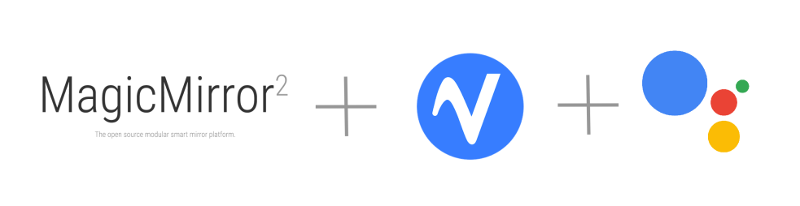

<p align="center">
  
</p>

<p align="center">
  <a href="#">
    
  </a>
  <a href="https://opensource.org/licenses/MIT" target="_blank">
    
  </a>
</p>

# MMM-GoogleAssistant

MMM-GoogleAssistant is a customizable hotword detection module to activate/notify other [MagicMirror](https://github.com/MichMich/MagicMirror) modules

## Wake Word
My wakeword is set to "jarvis", others include :

The default hotwords are:
``` js
ALEXA: ALEXA,
AMERICANO: AMERICANO,
BLUEBERRY: BLUEBERRY,
BUMBLEBEE: BUMBLEBEE,
COMPUTER: COMPUTER,
GRAPEFRUIT: GRAPEFRUIT,
GRASSHOPPER: GRASSHOPPER,
HEY_GOOGLE: HEY_GOOGLE,
HEY_SIRI: HEY_SIRI,
JARVIS: JARVIS,
OK_GOOGLE: OK_GOOGLE,
PICOVOICE: PICOVOICE,
PORCUPINE: PORCUPINE,
TERMINATOR: TERMINATOR,
```

See [Picovoice Porcupine](https://github.com/Picovoice/porcupine) for info on how to train your own model

## Installation 
```sh
cd ~/MagicMirror/modules
git clone https://github.com/jeffmur/MMM-GoogleAssistant
cd MMM-GoogleAssistant
npm install
```

## Configuration
A sample configuration is available on Smart Mirror as [sample.config.json](https://github.com/jeffmur/Smart-Mirror/blob/main/sample.config.js). There are two other modules that connect to this service: MMM-ProfileSwitcher and MMM-DeviceControl which controls Volume + Screensaver on Raspberry Pi Buster. See the main repo: https://github.com/jeffmur/Smart-Mirror

### Advanced
Supports multiple hotwords & sensitivities
```js
{
  module: 'MMM-GoogleAssistant',
  config: {
    debug: false,
    hotword: ["jarvis"],
    sensitivity: [0.7]
  }
  classes: "everyone" // authorized users get access to Google Assistant
}
```

### Options

- `debug` - turn on/off debug mode.

- `hotword` - The hotword you wish to detect.

- `sensitivity` - Override default sensitivity value 
    * Value could be within a range from `0.0` to `1.0`.
    * Default sensitivity values is 0.7

 ### Notifications
 MMM-GoogleAssistant can receive notification for start or stop listening based on user login events from [MMM-ProfileSwitcher](https://github.com/jeffmur/MMM-ProfileSwitcher)
  * `ASSISTANT_START`: Start listening for hotwords
  * `ASSISTANT_STOP`: Stop listening for hotwords
  
